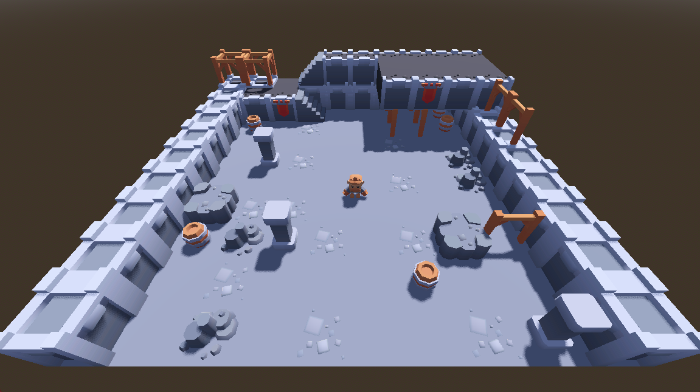
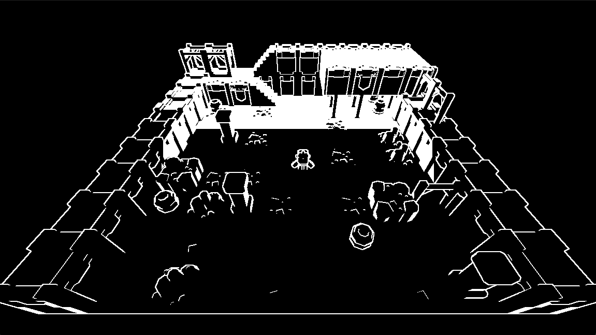
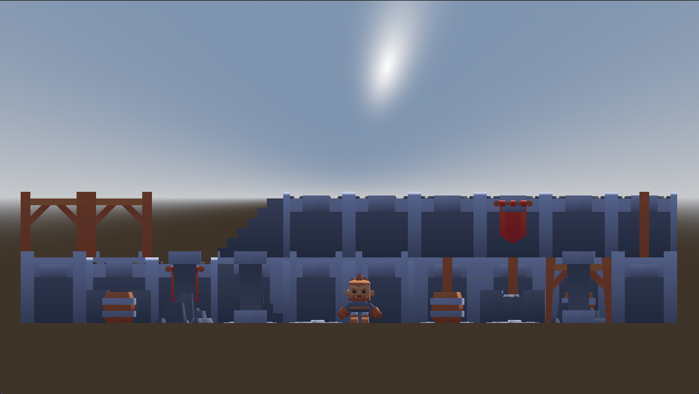
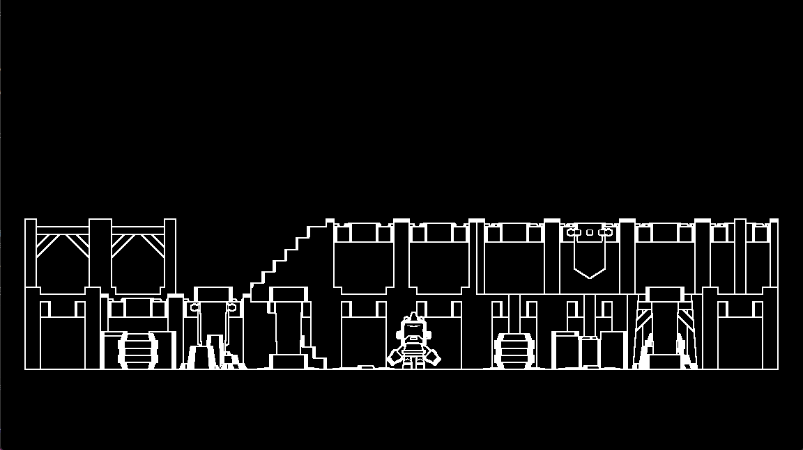

# Godot 3D Screenspace Shader Notes

1. Create a new MeshInstance3D in your 3D scene
2. Add a QuadMesh mesh to the instance
   - Optional? Move the mesh out of the center of the screen
3. In `Geometry` for the instance, increase the `Extra Cull Margin` to the max
   - As of writing, 16384 m
4. In the Quadmesh, increase the size from 1x1 m to 2x2 m
5. In the Quadmesh, check the `Flip Faces` box so that it's True
6. In the Quadmesh, in `Material`, choose `New Shader Material`
7. In the Material, in `Shader`, choose `New Shader`
8. Here you can choose a name for your shader and we can start customizing!

## Depth-based Edge Detection w/ Sobel Operator

```
shader_type spatial;
render_mode unshaded;

uniform sampler2D SCREEN_TEXTURE: hint_screen_texture, filter_linear_mipmap;
uniform sampler2D DEPTH_TEXTURE: hint_depth_texture, filter_linear_mipmap;

uniform float edge_threshold = 0.1;
uniform vec3 line_color: source_color = vec3(1.0);
uniform vec3 background_color: source_color = vec3(0.0);

const mat3 sobel_y = mat3(
	vec3(1.0, 0.0, -1.0),
	vec3(2.0, 0.0, -2.0),
	vec3(1.0, 0.0, -1.0)
);

const mat3 sobel_x = mat3(
	vec3(1.0, 2.0, 1.0),
	vec3(0.0, 0.0, 0.0),
	vec3(-1.0, -2.0, -1.0)
);

float linearize_depth(vec2 uv_coord, mat4 proj_matrix){
	float depth = texture(DEPTH_TEXTURE, uv_coord).x;
	vec3 ndc = vec3(uv_coord, depth) * 2.0 - 1.0;
	vec4 view = proj_matrix * vec4(ndc, 1.0);
	view.xyz /= view.w;
	float linear_depth = -view.z;
	return linear_depth;
}

void vertex(){
	POSITION = vec4(VERTEX, 1.0);
}

void fragment() {
	vec2 uv = SCREEN_UV;
	vec4 screen_color = texture(SCREEN_TEXTURE, uv);

	float depth = linearize_depth(uv, INV_PROJECTION_MATRIX);

	vec2 offset = 1.0 / VIEWPORT_SIZE;

	float n = linearize_depth(uv + vec2(0.0, -offset.y), INV_PROJECTION_MATRIX);
	float s = linearize_depth(uv + vec2(0.0, offset.y), INV_PROJECTION_MATRIX);
	float e = linearize_depth(uv + vec2(offset.x, 0.0), INV_PROJECTION_MATRIX);
	float w = linearize_depth(uv + vec2(-offset.x, 0.0), INV_PROJECTION_MATRIX);
	float nw = linearize_depth(uv + vec2(-offset.x, -offset.y), INV_PROJECTION_MATRIX);
	float ne = linearize_depth(uv + vec2(offset.x, -offset.y), INV_PROJECTION_MATRIX);
	float sw = linearize_depth(uv + vec2(-offset.x, offset.y), INV_PROJECTION_MATRIX);
	float se = linearize_depth(uv + vec2(offset.x, offset.y), INV_PROJECTION_MATRIX);

	mat3 surrounding_pixels = mat3(
		vec3(nw, n, ne),
		vec3(w, depth, e),
		vec3(sw, s, se)
	);

	float edge_x = dot(sobel_x[0], surrounding_pixels[0]) + dot(sobel_x[1], surrounding_pixels[1]) + dot(sobel_x[2], surrounding_pixels[2]);
	float edge_y = dot(sobel_y[0], surrounding_pixels[0]) + dot(sobel_y[1], surrounding_pixels[1]) + dot(sobel_y[2], surrounding_pixels[2]);

	float edge = sqrt(pow(edge_x, 2.0)+pow(edge_y, 2.0));

	if (edge > edge_threshold) {
		ALBEDO = line_color;
	} else {
		ALBEDO = background_color;
	}
}
```

### Screenshots









### Breakdown

```
shader_type spatial;
render_mode unshaded;
```

Since we're in the 3D space, our shader type is `spatial`. The render mode is `unshaded` to help make our example very clear. Feel free to experiment with other [render modes](https://docs.godotengine.org/en/stable/tutorials/shaders/shader_reference/spatial_shader.html#render-modes).

```
uniform sampler2D SCREEN_TEXTURE: hint_screen_texture, filter_linear_mipmap;
uniform sampler2D DEPTH_TEXTURE: hint_depth_texture, filter_linear_mipmap;
```

We pull the screen and depth textures into the `SCREEN_TEXTURE` and `DEPTH_TEXTURE` variables. The screen texture has information about all the pixels on the screen and the depth texture has information about how far away things are from the camera.

```
uniform float edge_threshold = 0.1;
uniform vec3 line_color: source_color = vec3(1.0);
uniform vec3 background_color: source_color = vec3(0.0);
```

Our chosen variables. These can be adjusted as necessary. The edge threshold defines how different 2 pixels need to be to be considered an edge. The line color is set to white, the background color is set to black.

```
const mat3 sobel_y = mat3(
	vec3(1.0, 0.0, -1.0),
	vec3(2.0, 0.0, -2.0),
	vec3(1.0, 0.0, -1.0)
);

const mat3 sobel_x = mat3(
	vec3(1.0, 2.0, 1.0),
	vec3(0.0, 0.0, 0.0),
	vec3(-1.0, -2.0, -1.0)
);
```

These are the [Sobel operators](https://en.wikipedia.org/wiki/Sobel_operator). We will use them to take the depth of the pixels surrounding each pixel and accentuate the depth differences to either side. This will make it easier to tell when there is a materially different depth from one side of the pixel to the other.

```
float linearize_depth(vec2 uv_coord, mat4 proj_matrix){
	float depth = texture(DEPTH_TEXTURE, uv_coord).x;
	vec3 ndc = vec3(uv_coord, depth) * 2.0 - 1.0;
	vec4 view = proj_matrix * vec4(ndc, 1.0);
	view.xyz /= view.w;
	float linear_depth = -view.z;
	return linear_depth;
}
```

I'd recommend reading the [advanced post-processing article](https://docs.godotengine.org/en/stable/tutorials/shaders/advanced_postprocessing.html#) in the Godot documentation. Basically, this function will take in a coordinate on the screen and return a new depth that is linearized with the view space. We will call this function from the fragment part of the shader, passing in the inverse projection matrix, `INV_PROJECTION_MATRIX`.
