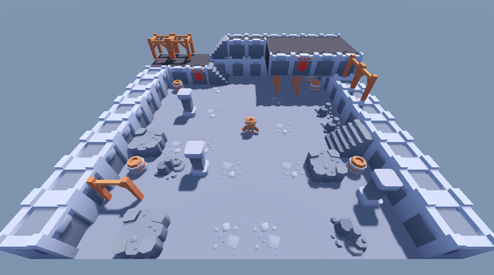
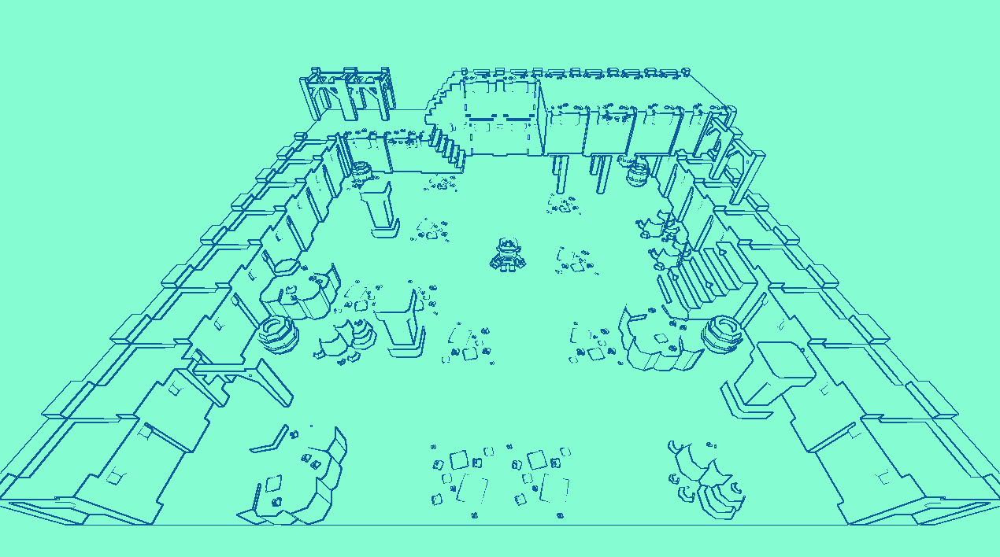
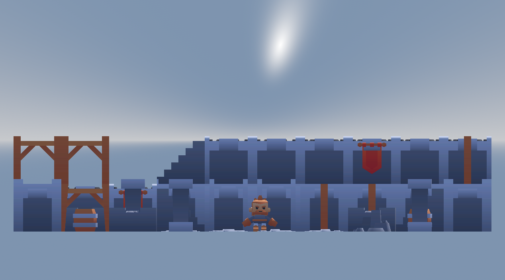
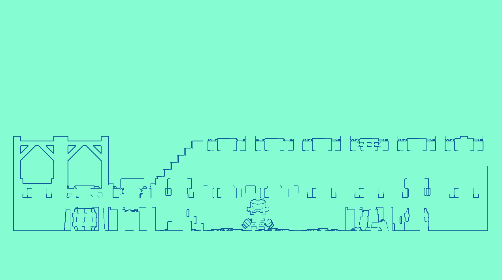

# Noise Offset Shader

## Setting up a 2D Screenspace Shader in Godot

1. Create a new CanvasLayer in your 2D or 3D scene
2. Create a ColorRect as a child of the CanvasLayer
3. Use the FullRect anchor preset to size the ColorRect to fill the whole screen
4. In the ColorRect, in `CanvasItem`, under `Material`, choose `New Shader Material`
5. In the Material, in `Shader`, choose `New Shader`
6. Here you can choose a name for your shader and we can start customizing!

## Shader Code

```
shader_type spatial;
render_mode unshaded;

uniform sampler2D SCREEN_TEXTURE: hint_screen_texture, filter_linear_mipmap;
uniform sampler2D NORMAL_TEXTURE : hint_normal_roughness_texture, filter_linear_mipmap;

uniform float edge_threshold = 0.2;
uniform vec3 line_color: source_color = vec3(0.043, 0.282, 0.467);
uniform vec3 background_color: source_color = vec3(0.408, 0.969, 0.694);

const mat3 sobel_y = mat3(
	vec3(1.0, 0.0, -1.0),
	vec3(2.0, 0.0, -2.0),
	vec3(1.0, 0.0, -1.0)
);

const mat3 sobel_x = mat3(
	vec3(1.0, 2.0, 1.0),
	vec3(0.0, 0.0, 0.0),
	vec3(-1.0, -2.0, -1.0)
);

void vertex(){
	POSITION = vec4(VERTEX, 1.0);
}

void fragment() {
	vec2 uv = SCREEN_UV;
	vec4 screen_color = texture(SCREEN_TEXTURE, uv);
	vec3 normal = texture(NORMAL_TEXTURE, uv).rgb;
	normal = normal * 2.0 - 1.0;
	vec2 offset = 1.0 / VIEWPORT_SIZE;

	vec3 n = texture(NORMAL_TEXTURE, uv + vec2(0.0, -offset.y)).rgb;
	vec3 s = texture(NORMAL_TEXTURE, uv + vec2(0.0, offset.y)).rgb;
	vec3 e = texture(NORMAL_TEXTURE, uv + vec2(offset.x, 0.0)).rgb;
	vec3 w = texture(NORMAL_TEXTURE, uv + vec2(-offset.x, 0.0)).rgb;
	vec3 nw = texture(NORMAL_TEXTURE, uv + vec2(-offset.x, -offset.y)).rgb;
	vec3 ne = texture(NORMAL_TEXTURE, uv + vec2(offset.x, -offset.y)).rgb;
	vec3 sw = texture(NORMAL_TEXTURE, uv + vec2(-offset.x, offset.y)).rgb;
	vec3 se = texture(NORMAL_TEXTURE, uv + vec2(offset.x, offset.y)).rgb;

	mat3 surrounding_pixels = mat3(
		vec3(length(nw-normal), length(n-normal), length(ne-normal)),
		vec3(length(w-normal), length(normal-normal), length(e-normal)),
		vec3(length(sw-normal), length(s-normal), length(se-normal))
	);

	float edge_x = dot(sobel_x[0], surrounding_pixels[0]) + dot(sobel_x[1], surrounding_pixels[1]) + dot(sobel_x[2], surrounding_pixels[2]);
	float edge_y = dot(sobel_y[0], surrounding_pixels[0]) + dot(sobel_y[1], surrounding_pixels[1]) + dot(sobel_y[2], surrounding_pixels[2]);

	float edge = sqrt(pow(edge_x, 2.0)+pow(edge_y, 2.0));

	if (edge > edge_threshold) {
		ALBEDO = line_color;
	} else {
		ALBEDO = background_color;
	}
}

```

## Screenshots









## Breakdown

```
shader_type spatial;
render_mode unshaded;
```

Since we're in the 3D space, our shader type is `spatial`. The render mode is `unshaded` to help make our example very clear. Feel free to experiment with other [render modes](https://docs.godotengine.org/en/stable/tutorials/shaders/shader_reference/spatial_shader.html#render-modes).

```
uniform sampler2D SCREEN_TEXTURE: hint_screen_texture, filter_linear_mipmap;
uniform sampler2D NORMAL_TEXTURE : hint_normal_roughness_texture, filter_linear_mipmap;
```

We pull the screen and normal textures into the `SCREEN_TEXTURE` and `NORMAL_TEXTURE` variables. The screen texture has information about all the pixels on the screen and the normal texture has information about what plane the surface is on (specifically the vector perpendicular to the plane at that pixel).

```
uniform float edge_threshold = 0.5;
uniform vec3 line_color: source_color = vec3(0.043, 0.282, 0.467);
uniform vec3 background_color: source_color = vec3(0.408, 0.969, 0.694);
```

Our chosen variables. These can be adjusted as necessary. The edge threshold defines how different 2 pixels need to be to be considered an edge. The line color is set to a darker blue, the background color is set to a lighter green.

```
const mat3 sobel_y = mat3(
	vec3(1.0, 0.0, -1.0),
	vec3(2.0, 0.0, -2.0),
	vec3(1.0, 0.0, -1.0)
);

const mat3 sobel_x = mat3(
	vec3(1.0, 2.0, 1.0),
	vec3(0.0, 0.0, 0.0),
	vec3(-1.0, -2.0, -1.0)
);
```

These are the [Sobel operators](https://en.wikipedia.org/wiki/Sobel_operator). We will use them to take the normal of the pixels surrounding each pixel and accentuate the differences to either side. This will make it easier to tell when there is a materially different normal from one side of the pixel to the other.

```
void vertex(){
	POSITION = vec4(VERTEX, 1.0);
}
```

I would encourage reading the [advanced post-processing article](https://docs.godotengine.org/en/stable/tutorials/shaders/advanced_postprocessing.html#) in the Godot documentation. I _believe_ this moves the Quadmesh so it stays in front of the camera at all times.

```
void fragment() {
	vec2 uv = SCREEN_UV;
	vec4 screen_color = texture(SCREEN_TEXTURE, uv);
	vec3 normal = texture(NORMAL_TEXTURE, uv).rgb;
	normal = normal * 2.0 - 1.0;
	vec2 offset = 1.0 / VIEWPORT_SIZE;
```

Here at the start of the fragment part of the shader, we get into the goods. We get the uv of the pixel, as well as the color. We get the normal vector based on the normal texture by grabbing the first 3 elements. Notably, there is a 4th element (w) that represents the roughness that we will not use. We also transform the normal a bit. I think this helps linearize the values, but I'm not sure. I pulled the equation from a [screen reading shaders article](https://docs.godotengine.org/en/stable/tutorials/shaders/screen-reading_shaders.html#normal-roughness-texture) in the Godot documentation. We also get the pixel dimensions of the viewport and put those into an `offset` variable.

```
	vec3 n = texture(NORMAL_TEXTURE, uv + vec2(0.0, -offset.y)).rgb;
	vec3 s = texture(NORMAL_TEXTURE, uv + vec2(0.0, offset.y)).rgb;
	vec3 e = texture(NORMAL_TEXTURE, uv + vec2(offset.x, 0.0)).rgb;
	vec3 w = texture(NORMAL_TEXTURE, uv + vec2(-offset.x, 0.0)).rgb;
	vec3 nw = texture(NORMAL_TEXTURE, uv + vec2(-offset.x, -offset.y)).rgb;
	vec3 ne = texture(NORMAL_TEXTURE, uv + vec2(offset.x, -offset.y)).rgb;
	vec3 sw = texture(NORMAL_TEXTURE, uv + vec2(-offset.x, offset.y)).rgb;
	vec3 se = texture(NORMAL_TEXTURE, uv + vec2(offset.x, offset.y)).rgb;

	mat3 surrounding_pixels = mat3(
		vec3(length(nw-normal), length(n-normal), length(ne-normal)),
		vec3(length(w-normal), length(normal-normal), length(e-normal)),
		vec3(length(sw-normal), length(s-normal), length(se-normal))
	);
```

Now, we use the offset to get the normal of each of the surrounding pixels and create a little matrix. For each element, we subtract the normal of our chosen pixel from the normal of the adjacent pixel and get the length of the resulting vector. Each element represents how different it is from the chosen pixel normal.

```
	float edge_x = dot(sobel_x[0], surrounding_pixels[0]) + dot(sobel_x[1], surrounding_pixels[1]) + dot(sobel_x[2], surrounding_pixels[2]);
	float edge_y = dot(sobel_y[0], surrounding_pixels[0]) + dot(sobel_y[1], surrounding_pixels[1]) + dot(sobel_y[2], surrounding_pixels[2]);

	float edge = sqrt(pow(edge_x, 2.0)+pow(edge_y, 2.0));

	if (edge > edge_threshold) {
		ALBEDO = line_color;
	} else {
		ALBEDO = background_color;
	}
}
```

Let's finish our explanation with some vector math 😈. The sobel matrices and our matrix of pixel normal differences are the same size. We take the sum of the dot products of the vectors in the x and y directions to see if there is a horizontal or vertial gradient/edge at the pixel. Then we average those values to get a final `edge`. This works because the dot product outputs a value of how different the vectors are. Summing them will result in a value between 0 and 1. We check if the value is above a threshold (0.5), and if so, we change the pixel color to be the line (blue) else background (green). Here, you can get creative with how you adjust the image based on whether there is an edge or not.

## Notes

This shader does an okay job at edge detection, but it has some issues.

- If two objects at different heights have similar normal vectors, an edge won't be detected.
  - example - a square box on a flat floor. The top of the box and the floor have the same normal, so a perspective view wouldn't show an edge.
  - in an orthogonal or straight on view, normals have trouble flagging edges due to this
  - there are lots of ways to solve this issue, the one I've heard about most is to use the depth vectors
  - basically to make sure the two pixels are on different planes
- you can get thinner lines by reducing your offset

```
vec2 offset = 0.5 / VIEWPORT_SIZE;
```

- this effectively upscales your normal texture when looking at neighboring pixels
  - I have been told this has a large impact on performance, so be wary
